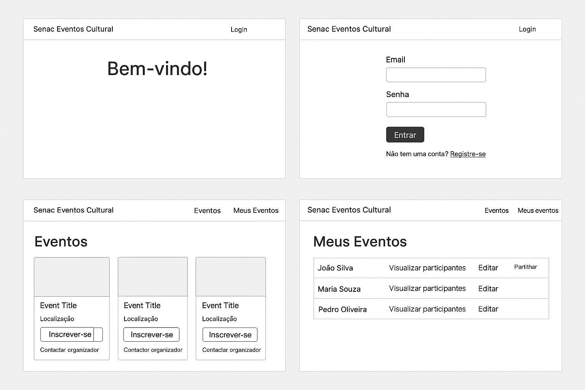

# 🎭 Senac Eventos Cultural – Frontend

Este é o frontend da aplicação **Senac Eventos Cultural**, um sistema web para cadastro e visualização de eventos culturais.

---

## 📚 O que é este projeto?

Plataforma com dois tipos de usuários:

- **Organizador**: pode cadastrar eventos (com nome, descrição, localidade, banner e valor).
- **Participante**: pode visualizar eventos e se inscrever.
- Os organizadores podem ver a lista de inscritos e gerenciar seus eventos.

---

## 🚀 Tecnologias utilizadas

- **React + Vite**
- **TypeScript**
- **CSS Modules**
- **Axios (para chamadas à API)**
- **React Router Dom (para rotas protegidas e públicas)**

---

## 🗂 Estrutura de Pastas

```
senac-eventos-cultural-frontend/
├── src/
│   ├── assets/             # Imagens e arquivos estáticos
│   ├── components/         # Componentes reutilizáveis (botões, cabeçalho, etc.)
│   ├── config/             # Arquivo de rotas nomeadas (routes.tsx)
│   ├── middlewares/        # Proteções de rota, como ProtectedRoute e AdminRoute
│   ├── pages/              # Páginas da aplicação, organizadas por módulo
│   ├── routes/             # Arquivo index.tsx com todas as rotas configuradas
│   ├── services/           # Configuração do Axios e chamadas à API
│   ├── styles/             # Arquivos de estilo globais (App.css, variáveis, reset)
│   ├── App.tsx             # Ponto principal que carrega o roteador
│   ├── main.tsx            # Entrada da aplicação React
│   └── vite-env.d.ts       # Tipagens do ambiente Vite
├── public/                 # Arquivos públicos como favicon e index.html base
├── .env.example            # Modelo das variáveis de ambiente
├── index.html              # HTML base da aplicação
├── package.json            # Lista de dependências e scripts
└── tsconfig.json           # Configurações do TypeScript
```

Essa organização facilita a manutenção e separa claramente responsabilidades, sendo ideal para projetos didáticos com escalabilidade futura.

---

## 🖼️ Wireframes



## 🪂 Como rodar este projeto localmente?

### 1. 🍴 Faça o fork do repositório

1. Clique no botão **Fork** no canto superior direito.
2. Crie uma cópia no seu GitHub pessoal.

### 2. 📥 Clone o repositório

No terminal:

```bash
git clone https://github.com/seu-usuario/senac-eventos-cultural-frontend.git
cd senac-eventos-cultural-frontend
```

### 3. 📦 Instale as dependências

```bash
npm install
```

---

## 🔐 Variáveis de ambiente

Crie um arquivo `.env` na raiz do projeto com base no exemplo:

```bash
cp .env.example .env
```

No `.env`, defina a URL da sua API (provavelmente rodando localmente ou hospedada no Railway):

```env
VITE_API_URL=http://localhost:3333
```

---

## ▶️ Iniciando a aplicação

```bash
npm run dev
```

A aplicação abrirá no navegador em:

```
http://localhost:5173
```

---

## ✅ Funcionalidades esperadas

- Página inicial com lista de eventos
- Página de login e cadastro
- Página para criar evento (organizador)
- Página de detalhes de evento com botão de inscrição (participante)
- Área do organizador para visualizar e gerenciar inscritos

---

## 💬 Dúvidas?

Fale com seu professor ou envie uma *issue* neste repositório.

---
